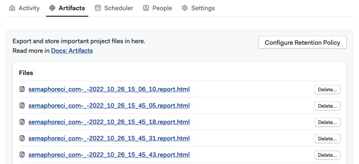
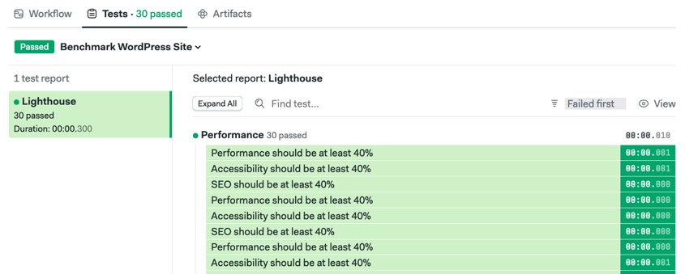

# Lighthouse Benchmarks Example for WordPress Site

This demo runs Google's [Lighthouse CI](https://github.com/GoogleChrome/lighthouse-ci) to benchmark a WordPress site.

## Requirements

- Node v12 or better
- Chrome
- Semaphore CI/CD
- GitHub or Bitbucket account

Install dependencies:

```bash
$ npm install
```

## Configure

Main config file is located at `lighthouserc.js`. You can set URLs to scan and error thresholds that cause the command to fail.

Alternatively, instead of setting thresholds on `lighthouserc.js`, you can run/tweak the more detailed audit test script `audit.test.js`. This allows for more fine-grained settings and produces a JUnit-compatible output with integrates into Semaphore test results.

## Run locally

Scan site:

```bash
$ npm start
```

Analyze report files and export JUnit manifest.

```bash
$ npm run audit
```

## Continuous Integration

The demo includes a Semaphore CI/CD pipeline.


You can view the Lightout HTML reports in the Artifacts tab:



All the past reports can be reviewed directly from the artifacts:


The pipeline uses test reports integration to generate a more user friendly experience.



## Licence

MIT